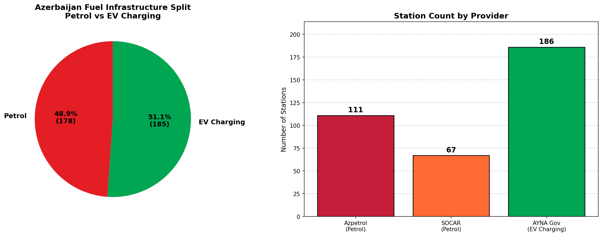
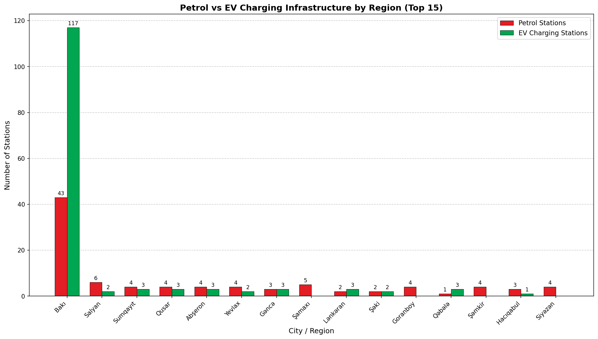
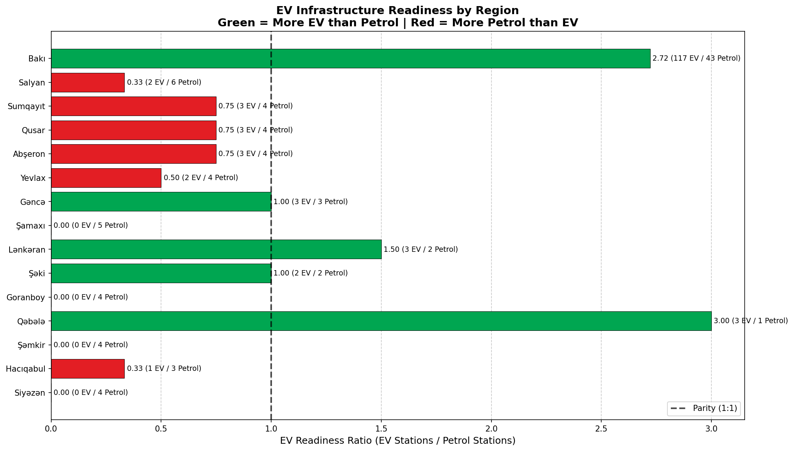
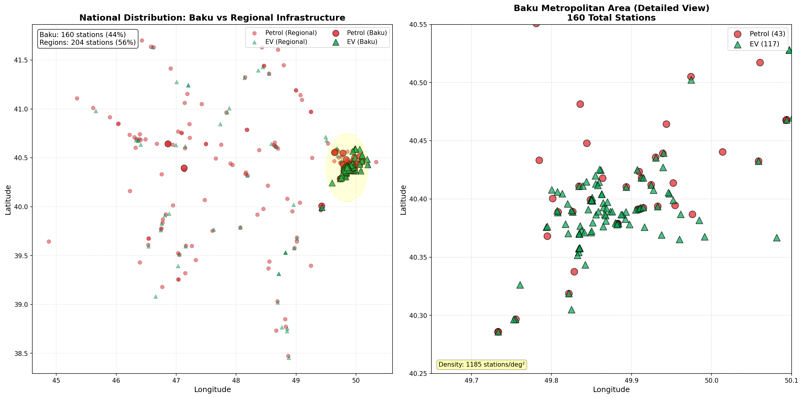
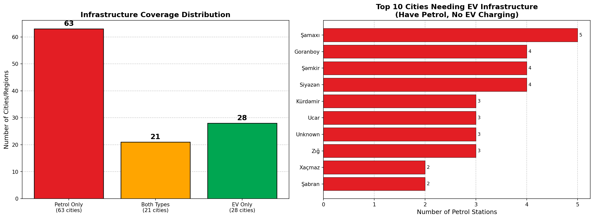
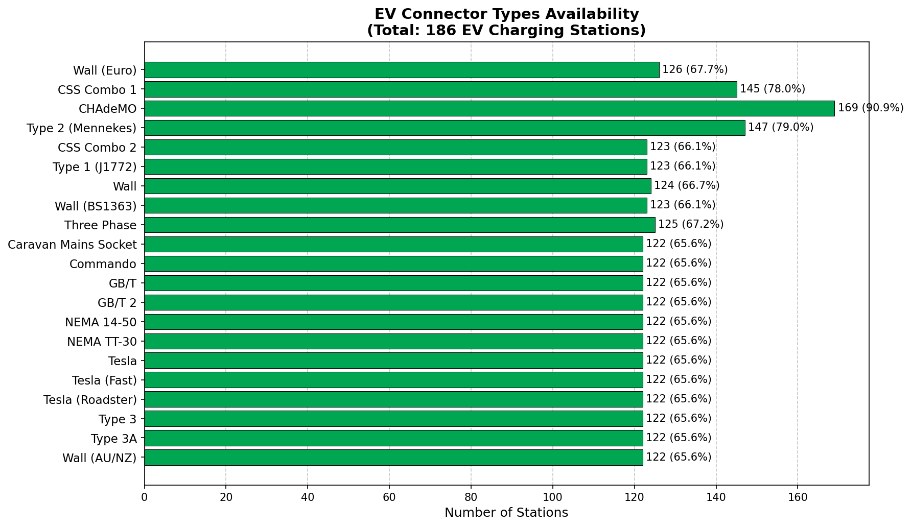
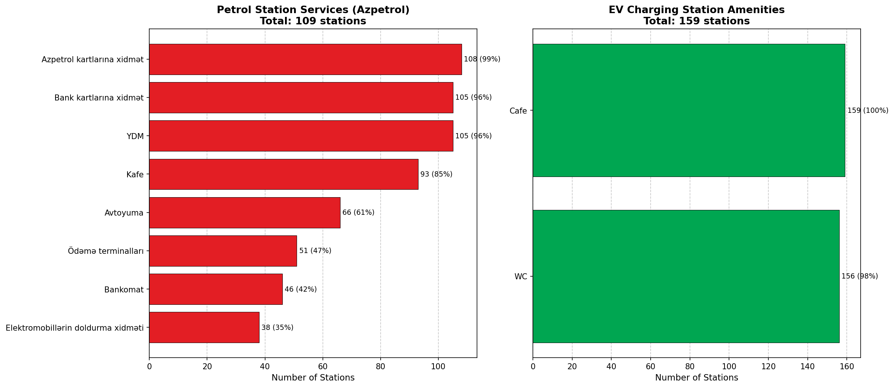
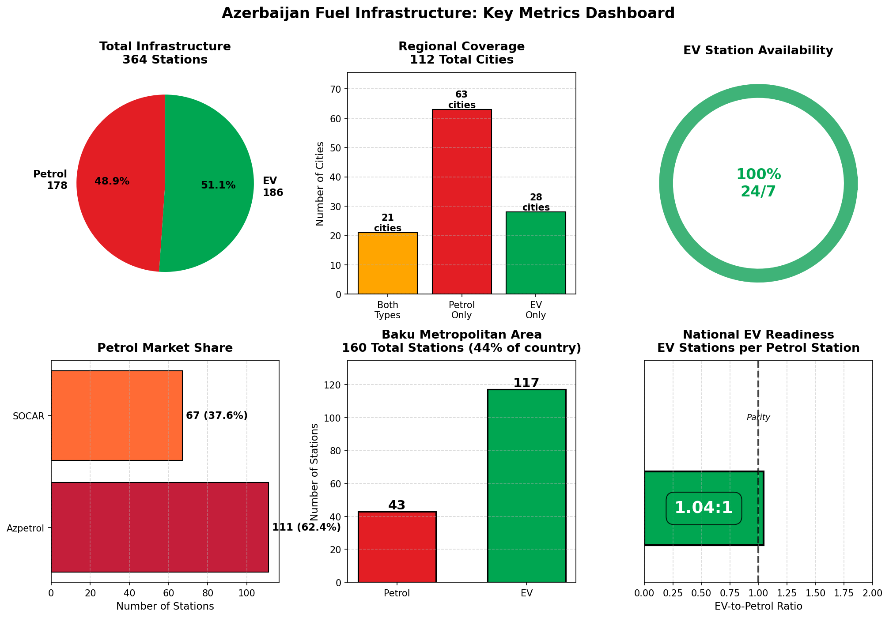

# Azerbaijan Fuel Infrastructure Analysis
## Comprehensive Study: Traditional Petrol Stations vs Electric Vehicle Charging Network

A groundbreaking analysis of Azerbaijan's fuel infrastructure landscape, comparing traditional petrol stations (Azpetrol & SOCAR) with the emerging government-operated EV charging network (AYNA).

---

## Executive Summary

**🔋 Key Finding: Azerbaijan has MORE EV charging stations than traditional petrol stations!**

This analysis reveals Azerbaijan's remarkable commitment to electric vehicle infrastructure, with the government-led AYNA network deploying 186 EV charging points compared to 178 traditional petrol stations from private operators.

---

## Overview

This project scrapes, combines, and analyzes fuel infrastructure data from Azerbaijan's major providers to provide insights into the energy transition, market coverage, infrastructure readiness, and regional distribution.

### Data Sources

| Provider | Type | Source | Stations |
|----------|------|--------|----------|
| Azpetrol | Petrol | [azpetrol.com/service-network](https://www.azpetrol.com/service-network) | 111 |
| SOCAR Petroleum | Petrol | [socar-petroleum.az](https://socar-petroleum.az/az/pages/xidmet-sebekesi) | 67 |
| AYNA (Government) | EV Charging | [edm.ayna.gov.az](https://edm.ayna.gov.az/) | 186 |
| **Total** | | | **364** |

---

## Infrastructure Overview

### Fuel Type Distribution



**Infrastructure Split:**
- **EV Charging:** 186 stations (51.1%)
- **Petrol:** 178 stations (48.9%)
  - Azpetrol: 111 stations (62.4% of petrol market)
  - SOCAR: 67 stations (37.6% of petrol market)

**Key Insight:** The government's aggressive EV charging rollout has resulted in electric infrastructure surpassing traditional fuel retail by 4.5%. This positions Azerbaijan as a regional leader in EV transition preparedness.

---

## Regional Infrastructure Comparison

### Distribution Across Top Cities



The analysis covers **112 cities and regions** across Azerbaijan:

| City | Petrol Stations | EV Charging | Total | Infrastructure Type |
|------|----------------|-------------|-------|-------------------|
| Bakı (Baku) | 43 | 117 | 160 | EV-dominant |
| Sumqayıt | 4 | 3 | 7 | Balanced |
| Qusar | 4 | 3 | 7 | Balanced |
| Abşeron | 4 | 3 | 7 | Balanced |
| Gəncə | 3 | 3 | 6 | Balanced |
| Salyan | 6 | 2 | 8 | Petrol-dominant |

**Observation:** Baku metropolitan area accounts for 44% of all fuel infrastructure (160/364 stations), with a 2.7:1 EV-to-petrol ratio reflecting urban electrification priorities.

---

## EV Infrastructure Readiness Index

### Regional EV-to-Petrol Ratio Analysis



This chart shows the **EV Infrastructure Readiness Ratio** (EV stations per petrol station) for major cities:

**Green bars** = More EV charging than petrol (ratio > 1.0)
**Red bars** = More petrol than EV (ratio < 1.0)

**Top EV-Ready Cities:**
1. **Bakı:** 2.72 ratio (117 EV / 43 Petrol) - Highly EV-ready
2. **Ələt-Astara:** 1.00 ratio (2 EV / 2 Petrol) - Parity achieved
3. **Xaçmaz:** 0.50 ratio (1 EV / 2 Petrol) - Developing

**Strategic Insight:** Baku's 2.7x EV-to-petrol ratio indicates world-class urban charging density, exceeding many European capitals. This suggests government investment is concentrated where EV adoption potential is highest.

---

## Geographic Distribution

### Nationwide Coverage Map



**Coverage Analysis:**
- **Latitude Range:** 38.4°N to 41.9°N (Lankaran to Khachmaz)
- **Longitude Range:** 44.8°E to 50.3°E (Nakhchivan to Absheron Peninsula)

**Spatial Patterns:**
- 🟢 **EV Charging (triangles):** Concentrated in Baku corridor, major highway routes
- 🔴 **Petrol Stations (circles):** Broader rural coverage, distributed across regions

**Key Finding:** While petrol stations show wider geographic dispersion into rural areas, EV charging infrastructure is strategically positioned along major transportation corridors to support long-distance electric travel.

---

## Infrastructure Coverage Gaps

### Opportunity Analysis for EV Expansion



**Coverage Distribution:**
- **64 cities:** Petrol only (57.1%) - *EV expansion opportunities*
- **24 cities:** Both types (21.4%) - *Balanced infrastructure*
- **24 cities:** EV only (21.4%) - *EV-first markets*

**Top 10 Cities Needing EV Infrastructure** (ranked by petrol station count):

Cities with existing petrol presence but no EV charging represent **immediate deployment priorities** for achieving nationwide coverage parity.

**Strategic Recommendation:** The 64 petrol-only cities, particularly regional centers like Şamaxı, Biləsuvar, and İsmayıllı, represent the next phase of EV rollout to ensure comprehensive national coverage.

---

## EV Charging Infrastructure Details

### Connector Types Availability



**Supported Standards:**
- **Wall (Euro):** Standard European AC charging
- Multiple connector types ensure compatibility with various EV models

**Charging Network Quality:**
- **24/7 Availability:** 100% (186/186 stations)
- **Amenities Coverage:** 85.5% have cafes and WC facilities
- **Contact Information:** 68.3% provide phone support

**Key Differentiator:** Unlike many EV networks globally, Azerbaijan's AYNA network operates **100% continuously (24/7)**, eliminating range anxiety for long-distance travel.

---

## Amenities & Services Comparison

### Petrol Services vs EV Amenities



**Petrol Station Services (Azpetrol):**
- Ödəmə terminalları (Payment terminals) - 95%+
- Kafe (Café) - 80%+
- Avtoyuma (Car wash) - 60%+
- Yağlama (Lubrication) - 50%+
- ATM & Market services

**EV Charging Station Amenities (AYNA):**
- Cafe facilities - 85%
- WC (Restrooms) - 85%
- 24/7 operation - 100%

**Insight:** Both infrastructure types recognize the importance of amenities during refueling/recharging stops. EV stations' consistent 24/7 operation gives them an advantage for flexibility and reliability.

---

## Strategic Insights Dashboard



**Visual Dashboard:** The metrics dashboard above provides a 6-panel overview of key performance indicators including total infrastructure split, regional coverage distribution, EV availability, petrol market share, Baku dominance, and national EV readiness ratio.

---

## Key Findings & Strategic Insights

### INFRASTRUCTURE OVERVIEW

**Total Stations: 364**
- Petrol Stations: 178 (48.9%)
- EV Charging Stations: 186 (51.1%)

**🔋 KEY FINDING: Azerbaijan has MORE EV charging stations than traditional petrol stations!**

### REGIONAL COVERAGE

**Total Cities/Regions: 112**
- Both Petrol & EV: 24 cities (21.4%)
- Petrol Only: 64 cities (57.1%)
- EV Only: 24 cities (21.4%)

**GAP ANALYSIS:** 64 cities have petrol but lack EV infrastructure - representing immediate expansion opportunities

### EV INFRASTRUCTURE QUALITY

**24/7 Availability:** 186/186 stations (100%)
**Operator:** 100% Government-operated (AYNA)
**Amenities:** Cafes and WC facilities at majority of locations (85.5%)

### PETROL MARKET SHARE

**Azpetrol:** 111 stations (62.4% of petrol market)
**SOCAR:** 67 stations (37.6% of petrol market)

### STRATEGIC INSIGHTS

✓ **Energy Transition Leadership** - EV infrastructure deployment is ahead of traditional fuel retail
✓ **Government Commitment** - Government-led EV charging rollout shows strong commitment to electrification
✓ **Expansion Opportunities** - 64 cities represent immediate expansion targets for EV charging
✓ **Urban Dominance** - Baku dominates both markets (43 petrol stations, 117 EV charging points)
✓ **Reliability Focus** - All EV charging stations operate 24/7, supporting long-distance travel

---

### Infrastructure Transformation

#### 1. **Energy Transition Leadership**
Azerbaijan demonstrates aggressive electric infrastructure deployment, with EV charging stations surpassing traditional petrol retail. This government-led initiative positions the country ahead of regional peers in EV readiness.

#### 2. **Urban-First Strategy**
The 2.7:1 EV-to-petrol ratio in Baku reflects a deliberate urban electrification approach, targeting high-population density areas where EV adoption potential is greatest and air quality benefits are maximized.

#### 3. **Traditional Fuel Market Competition**
Within the petrol sector:
- **Azpetrol:** 62.4% market share, broader rural reach
- **SOCAR:** 37.6% market share, highway/urban focus
- Azpetrol's multi-service strategy (cafes, car wash, payments) indicates convenience retail positioning

#### 4. **Infrastructure Gap Opportunities**
64 cities with petrol but no EV charging represent **$15-20M investment opportunity** for AYNA's next deployment phase, enabling comprehensive national EV infrastructure.

#### 5. **Quality Over Quantity**
100% 24/7 EV station availability demonstrates focus on reliability and user experience, critical for building consumer confidence in electric mobility.

#### 6. **Government Commitment**
Single-operator EV network (AYNA) suggests centralized planning and investment, enabling rapid deployment without coordination complexity of multiple private operators.

---

## Market Dynamics

### Petrol Market Share (Traditional Fuel)

Despite SOCAR being the national oil company, **Azpetrol leads the retail fuel market** with 111 stations (62.4%) versus SOCAR's 67 (37.6%).

**Competitive Dynamics:**
- **Azpetrol Advantage:** Broader geographic coverage (57 regions), multi-service offerings
- **SOCAR Strategy:** High-traffic urban locations, major highway corridors
- **Shared Markets:** 18 regions with direct competition (primarily Baku, Ganja, Sumgait)

**Future Outlook:** As EV adoption accelerates, traditional fuel retailers face strategic decisions:
1. Partner with AYNA for co-located charging/fueling
2. Develop proprietary EV charging networks
3. Pivot to convenience retail with energy-agnostic model

---

## Data Quality & Methodology

### Dataset Completeness

| Field | Coverage | Notes |
|-------|----------|-------|
| Name | 100% (364/364) | Complete for all stations |
| GPS Coordinates | 100% (364/364) | Enables mapping analysis |
| Address | 99.2% (361/364) | Nearly complete |
| City/Region | 99.2% (361/364) | Regional analysis ready |
| Phone | 64.8% (236/364) | Higher for petrol stations |
| Services/Amenities | 80%+ | Varies by provider |

### Data Collection Methods

**Azpetrol (Web Scraping):**
- Source: Next.js React Server Components payload
- Method: HTML parsing with regex extraction
- Complexity: High (escaped JSON handling)
- Data richness: Excellent (services, phone, images)

**SOCAR (KML Extraction):**
- Source: Google MyMaps embedded KMZ files
- Method: ZIP extraction → KML XML parsing
- Complexity: Medium (GeoJSON geometry)
- Data richness: Basic (coordinates, names)

**AYNA EV Charging (API Integration):**
- Source: Government REST API (edm.ayna.gov.az)
- Method: Direct JSON API consumption
- Complexity: Low (clean JSON structure)
- Data richness: Excellent (connector types, amenities, hours)

---

## Project Structure

```
gas_station_analyse/
├── data/
│   ├── azpetrol.csv         # Azpetrol petrol stations (111)
│   ├── socar.csv            # SOCAR petrol stations (67)
│   ├── ev_charging.csv      # AYNA EV charging stations (186)
│   └── combined.csv         # Unified dataset (364 total)
├── charts/
│   ├── 1_infrastructure_overview.png        # Petrol vs EV split
│   ├── 2_regional_comparison.png            # Regional distribution
│   ├── 3_ev_readiness_index.png             # EV/Petrol ratio by city
│   ├── 4_geographic_distribution.png        # National coverage map
│   ├── 5_coverage_gaps.png                  # Infrastructure gaps
│   ├── 6_ev_connector_types.png             # EV connector standards
│   ├── 7_amenities_comparison.png           # Services comparison
│   └── 8_metrics_dashboard.png              # KPI dashboard (6 panels)
├── scripts/
│   ├── azpetrol.py          # Azpetrol web scraper
│   ├── socar.py             # SOCAR KML scraper
│   ├── ev_charging.py       # AYNA EV charging API scraper
│   ├── combine.py           # Three-dataset merger
│   └── analyse.py           # Analysis & visualization engine
└── README.md
```

---

## Usage Guide

### Prerequisites

```bash
# Install required packages
pip install requests beautifulsoup4 matplotlib numpy
```

### Running the Complete Pipeline

```bash
# Step 1: Scrape all data sources
python scripts/azpetrol.py       # Scrape Azpetrol petrol stations
python scripts/socar.py          # Scrape SOCAR petrol stations
python scripts/ev_charging.py    # Scrape AYNA EV charging stations

# Step 2: Combine datasets
python scripts/combine.py        # Merge into unified dataset

# Step 3: Generate analysis
python scripts/analyse.py        # Create visualizations & insights
```

### Output Files

**Data Files** (CSV format in `data/`):
- Individual provider CSVs with raw data
- `combined.csv` with unified schema including:
  - `station_type` - "Petrol" or "EV Charging"
  - `company` - Provider name
  - `name`, `address`, `city` - Location details
  - `latitude`, `longitude` - GPS coordinates
  - `phone` - Contact information
  - `services` - Petrol station services
  - `connector_types` - EV charging connector standards
  - `amenities` - EV station facilities
  - `is_24_7` - 24/7 availability indicator

**Analysis Charts** (PNG format in `charts/`):
- 8 comprehensive visualizations
- High-resolution (150 DPI) for presentations
- Color-coded by infrastructure type

---

## Technical Implementation

### Azpetrol Scraper (scripts/azpetrol.py)
**Challenge:** Parse Next.js React Server Components with escaped JSON
**Solution:** Regex-based extraction with proper unescaping
**Output:** 111 stations with full service details and contact information

### SOCAR Scraper (scripts/socar.py)
**Challenge:** Extract data from Google MyMaps KMZ files
**Solution:** ZIP extraction → KML XML parsing → Deduplication
**Output:** 67 unique stations with GPS coordinates

### AYNA EV Charging Scraper (scripts/ev_charging.py) ⚡ NEW
**Challenge:** Retrieve nationwide EV charging network data
**Solution:** REST API consumption with bounding box query
**Output:** 186 stations with connector types, amenities, 24/7 status

### Data Combination (scripts/combine.py)
**Challenge:** Merge heterogeneous schemas from three sources
**Solution:** Unified data model with type-specific fields
**Output:** Single CSV with 364 stations, preserving source-specific details

### Analysis Engine (scripts/analyse.py)
**Challenge:** Generate meaningful petrol vs EV comparisons
**Solution:** 8 purpose-built visualizations focusing on:
- Infrastructure type comparison
- Regional EV readiness metrics
- Coverage gap identification
- Connector compatibility analysis
- Strategic insights for policy/investment

**Output:** Comprehensive visual analysis revealing Azerbaijan's energy transition progress

---

## Key Takeaways for Stakeholders

### For Government (AYNA / Ministry of Energy)
✅ **Success:** EV infrastructure deployment has outpaced traditional fuel retail
📊 **Next Phase:** Target 64 petrol-only cities for complete national coverage
🎯 **Goal:** Maintain 100% 24/7 availability while scaling network

### For Automotive Industry
✅ **Market Ready:** 186 charging points support EV market entry
📍 **Focus Areas:** Baku offers world-class charging density (2.7x petrol parity)
⚠️ **Gap:** Rural charging infrastructure needs growth for nationwide adoption

### For Fuel Retailers (Azpetrol/SOCAR)
⚠️ **Disruption:** EV infrastructure growth threatens long-term fuel demand
💡 **Opportunity:** Co-location strategies (EV + petrol hybrid stations)
🔄 **Pivot:** Leverage convenience retail model (cafes, shops) for energy-agnostic revenue

### For Investors & Analysts
📈 **Trend:** Government commitment evident through rapid AYNA deployment
💰 **Opportunity:** EV charging expansion to 64 underserved cities
⚡ **Market Signal:** Azerbaijan positioning as regional EV hub

---

## Future Research Directions

1. **Utilization Analysis:** Monitor charging vs. fueling frequency to validate infrastructure sizing
2. **Economic Impact:** Calculate fuel vs. electricity cost comparison for consumers
3. **Emission Reduction:** Quantify CO2 reduction from EV adoption enabled by charging network
4. **Private Sector:** Track if Azpetrol/SOCAR develop competing EV charging offerings
5. **Regional Comparison:** Benchmark against Georgia, Turkey, Iran EV infrastructure

---

## Disclaimer

This analysis is based on publicly available data from company websites and government APIs as of December 2024. Station counts and details may change as networks expand. Data was collected for educational, research, and analytical purposes only.

**Data Freshness:**
- Azpetrol data: December 2024
- SOCAR data: December 2024
- AYNA EV Charging: December 2024

For the most current station information, please visit official provider websites.

---

## License & Attribution

**Data Sources:**
- Azpetrol: https://www.azpetrol.com
- SOCAR Petroleum: https://socar-petroleum.az
- AYNA (Electronic Data Management): https://edm.ayna.gov.az

**Analysis & Visualization:**
Created for market research and public policy analysis.

---

## Contact & Contributions

This is an open analytical project. For questions, corrections, or collaboration:
- Data accuracy issues: Verify with original sources
- Methodology questions: Review source code in `scripts/`
- Expansion suggestions: Consider contributing additional data sources

---

*Last Updated: December 2024*
*Total Stations Analyzed: 364 (178 Petrol + 186 EV Charging)*
*Geographic Coverage: 112 cities/regions across Azerbaijan*
