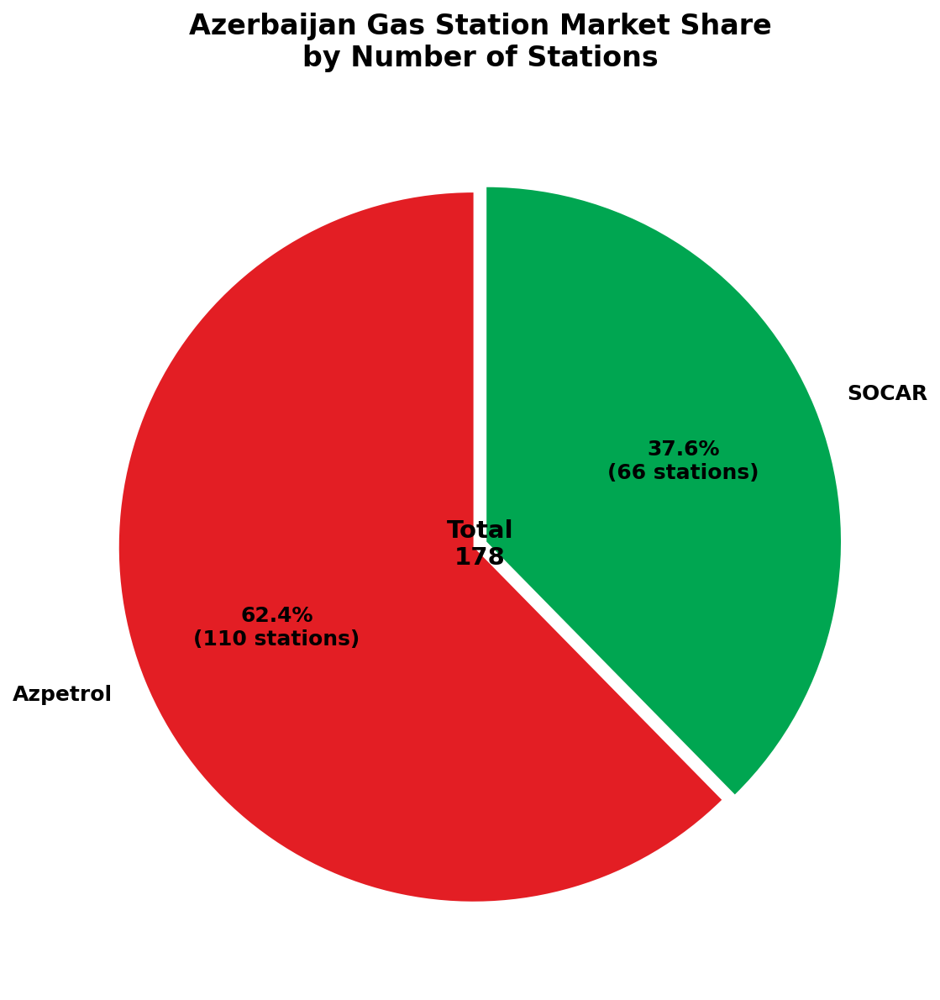
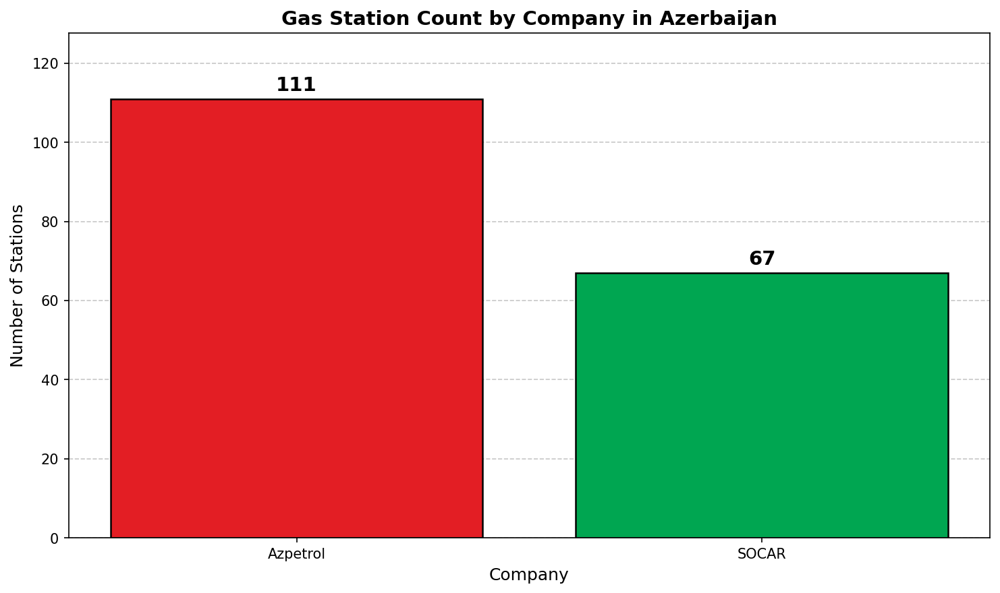
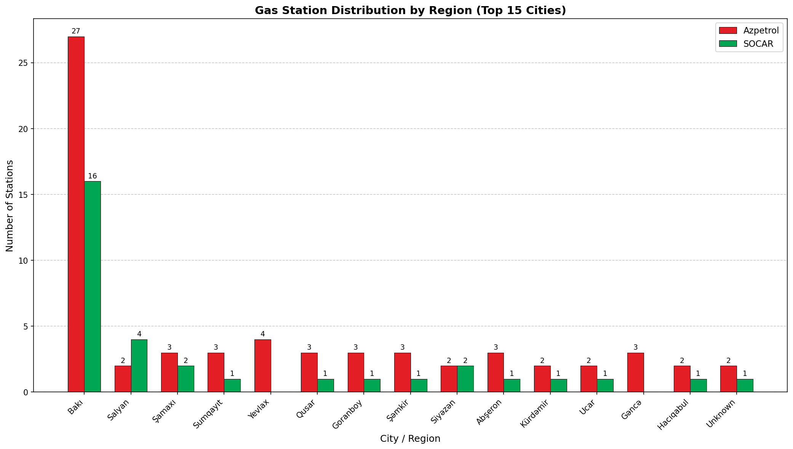
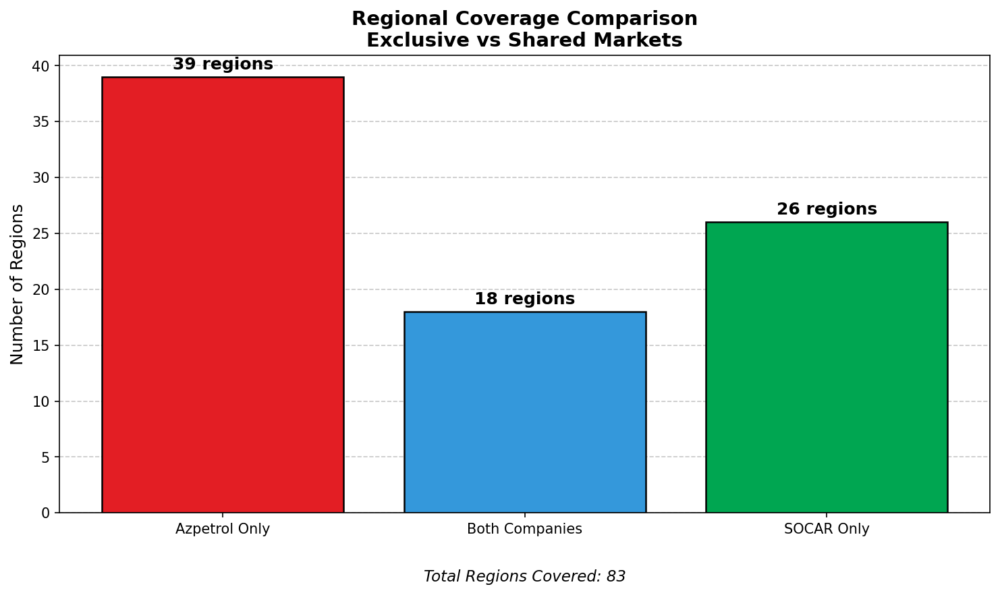
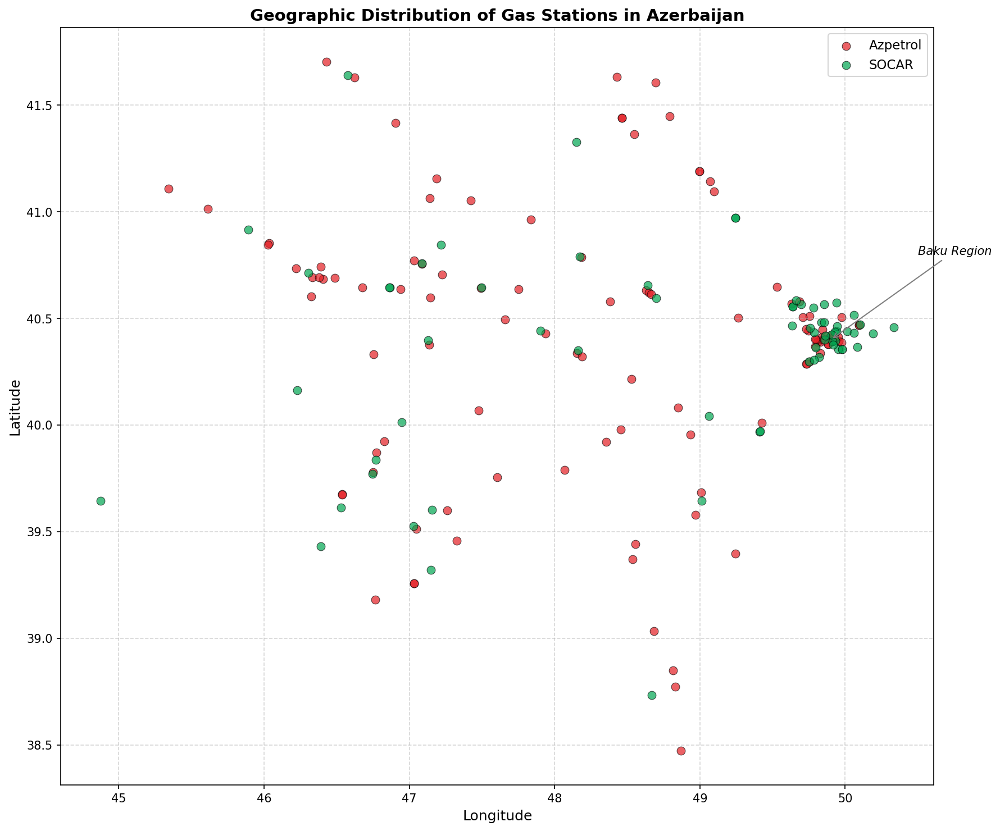
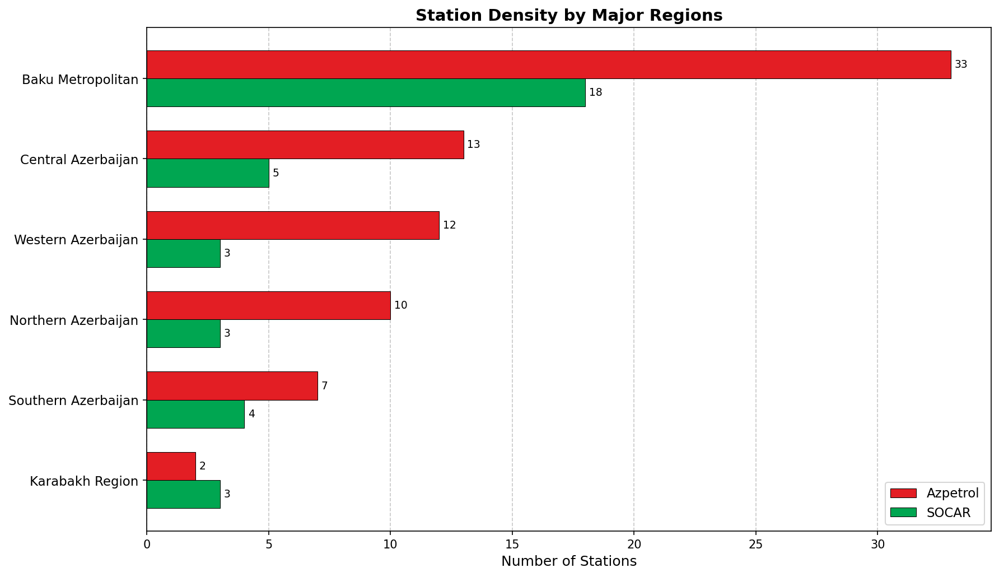
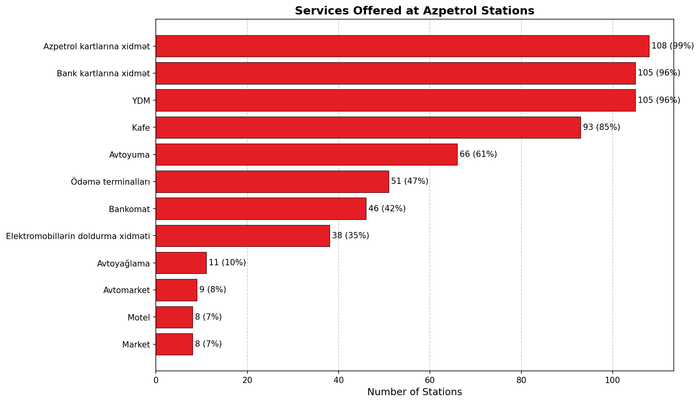
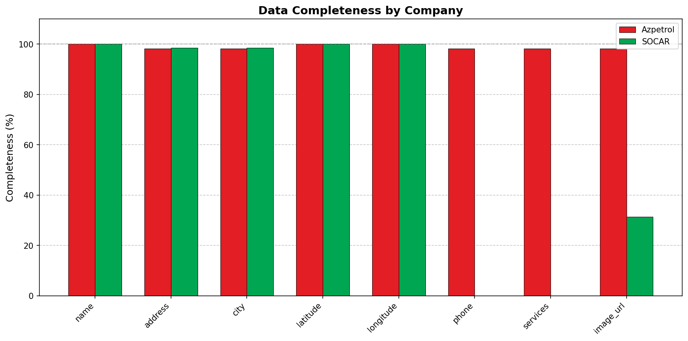

# Azerbaijan Gas Station Market Analysis

A comprehensive analysis of gas station networks in Azerbaijan, focusing on the two major players: **Azpetrol** and **SOCAR Petroleum**.

## Overview

This project scrapes, combines, and analyzes gas station data from Azerbaijan's leading fuel retailers to provide insights into market share, regional coverage, and service offerings.

### Data Sources

| Company | Source | Stations |
|---------|--------|----------|
| Azpetrol | [azpetrol.com/service-network](https://www.azpetrol.com/service-network) | 111 |
| SOCAR Petroleum | [socar-petroleum.az](https://socar-petroleum.az/az/pages/xidmet-sebekesi) | 67 |
| **Total** | | **178** |

---

## Market Share Analysis

### Overall Market Position



**Key Finding:** Azpetrol dominates the Azerbaijan fuel retail market with **62.4% market share** (111 stations), while SOCAR Petroleum holds **37.6%** (67 stations). This represents a significant lead of **44 stations** for Azpetrol.



Despite SOCAR being the national oil company, Azpetrol has built a larger retail network, suggesting a strategic focus on downstream distribution and customer accessibility.

---

## Regional Coverage Analysis

### Geographic Distribution



The analysis reveals distinct regional strategies between the two companies:

- **83 total regions/cities** have gas station coverage
- **Azpetrol** operates in more regions with exclusive presence in **39 markets**
- **SOCAR Petroleum** has exclusive presence in **26 markets**
- **18 regions** feature both companies competing directly

### Coverage Comparison



| Metric | Azpetrol | SOCAR | Insight |
|--------|----------|-------|---------|
| Total Stations | 111 | 67 | Azpetrol leads by 66% |
| Regions Covered | 57 | 44 | Broader Azpetrol reach |
| Avg. Stations/Region | 1.95 | 1.52 | Higher Azpetrol density |
| Exclusive Markets | 39 | 26 | More Azpetrol-only areas |

---

## Geographic Spread



### Coordinate Analysis

Both networks cover the geographic extent of Azerbaijan:

- **Latitude Range:** 38.4°N to 41.9°N (covering Lankaran to Khachmaz)
- **Longitude Range:** 44.8°E to 50.3°E (covering Nakhchivan to Absheron)

**Observations:**
- Azpetrol (red) shows wider dispersion across rural areas
- SOCAR (green) concentrates on major urban corridors
- Both have strong presence in Greater Baku metropolitan area
- Western regions show more Azpetrol presence
- Coastal and highway routes show balanced competition

---

## Regional Density Analysis



### Top Markets by Station Count

| Rank | Region | Stations | Primary Operator |
|------|--------|----------|------------------|
| 1 | Baku (Bakı) | 45+ | Both |
| 2 | Sumgait (Sumqayıt) | 8-10 | Both |
| 3 | Absheron | 6-8 | Both |
| 4 | Khirdalan | 5-6 | Both |
| 5 | Ganja (Gəncə) | 4-5 | Azpetrol-heavy |

The capital city Baku and surrounding areas account for approximately **40%** of all stations, reflecting the population and economic concentration.

---

## Service Analysis (Azpetrol)



Azpetrol provides detailed service information for their stations. Common services include:

| Service | Availability | Description |
|---------|--------------|-------------|
| Ödəmə terminalları | High | Payment terminals for convenience |
| Kafe | High | On-site cafe services |
| Avtoyuma | Medium | Car wash facilities |
| Yağlama | Medium | Lubrication services |
| EV Charging | Growing | Electric vehicle charging points |
| ATM | Medium | Banking services |

This diversification indicates a shift toward convenience retail, where fuel stations become multi-service destinations rather than single-purpose stops.

---

## Data Quality Assessment



### Completeness by Field

| Field | Records | Coverage |
|-------|---------|----------|
| Name | 178 | 100% |
| Coordinates | 178 | 100% |
| Address | 168 | 94.4% |
| City | 165 | 92.7% |
| Phone | 111 | 62.4% |
| Services | 111 | 62.4% |
| Image URL | 175 | 98.3% |

**Note:** Phone and services data is primarily available for Azpetrol stations, as SOCAR's Google MyMaps source doesn't include this information.

---

## Strategic Insights

### 1. Market Leadership
Azpetrol's larger network suggests either earlier market entry, more aggressive expansion, or different strategic priorities compared to SOCAR Petroleum.

### 2. Urban vs. Rural Strategy
- **SOCAR:** Focuses on high-traffic urban locations and major highways
- **Azpetrol:** Broader coverage including smaller towns and rural areas

### 3. Service Differentiation
Azpetrol's multi-service approach (cafes, payment terminals, EV charging) indicates a convenience retail strategy, while SOCAR appears more focused on core fuel distribution.

### 4. Competition Hotspots
The 18 shared markets represent key battlegrounds where both companies compete directly for customers. These are primarily:
- Baku metropolitan area
- Major regional cities (Ganja, Sumgait)
- Key highway corridors

### 5. Growth Opportunities
- **For Azpetrol:** Consolidate urban presence, expand EV infrastructure
- **For SOCAR:** Expand into Azpetrol-exclusive rural markets, add convenience services

---

## Project Structure

```
gas_station_analyse/
├── data/
│   ├── azpetrol.csv      # Raw Azpetrol station data
│   ├── socar.csv         # Raw SOCAR station data
│   └── combined.csv      # Merged dataset
├── charts/
│   ├── market_share_pie.png
│   ├── market_share_bar.png
│   ├── regional_distribution.png
│   ├── coverage_comparison.png
│   ├── services_analysis.png
│   ├── data_completeness.png
│   ├── geographic_spread.png
│   └── regional_density.png
├── scripts/
│   ├── azpetrol.py       # Azpetrol web scraper
│   ├── socar.py          # SOCAR web scraper
│   ├── combine.py        # Data merger
│   └── analyse.py        # Analysis & visualization
└── README.md
```

## Usage

### Prerequisites

```bash
pip install requests matplotlib
```

### Running the Scrapers

```bash
# Scrape Azpetrol stations
python scripts/azpetrol.py

# Scrape SOCAR stations
python scripts/socar.py

# Combine datasets
python scripts/combine.py

# Generate analysis charts
python scripts/analyse.py
```

### Data Output

All scraped data is saved in CSV format with the following key fields:
- `company` - Azpetrol or SOCAR
- `name` - Station name/identifier
- `address` - Full address
- `city` - City/region
- `latitude`, `longitude` - GPS coordinates
- `phone` - Contact number (where available)
- `services` - Available services (where available)
- `image_url` - Station photo URL

---

## Technical Notes

### Azpetrol Scraper
- Parses React Server Components (RSC) payload from Next.js application
- Handles escaped JSON in HTML script tags
- Extracts 111 stations with full service details

### SOCAR Scraper
- Downloads KMZ files from embedded Google MyMaps
- Extracts and parses KML XML data
- Deduplicates stations across multiple map layers
- Extracts 67 unique stations

---

## Disclaimer

This analysis is based on publicly available data from company websites. Station counts and details may vary as networks expand or change. Data was collected for educational and analytical purposes only.

---

*Analysis generated on December 2024*
